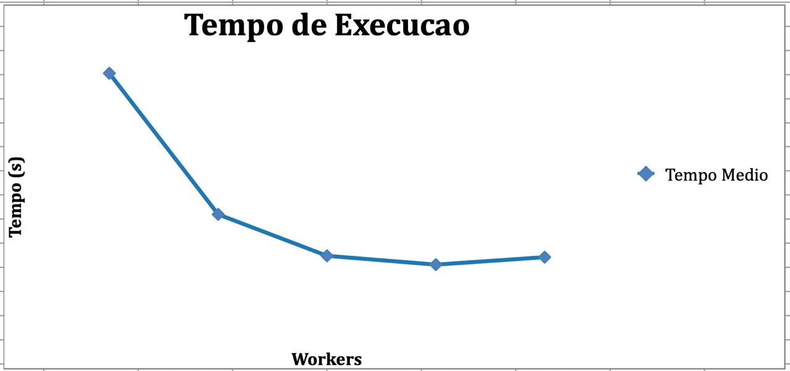
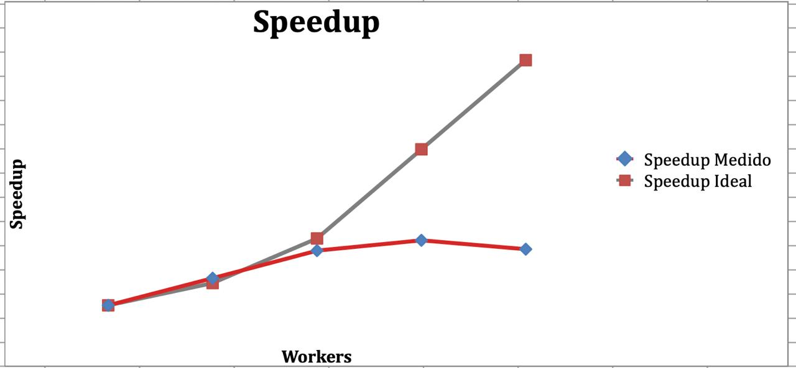
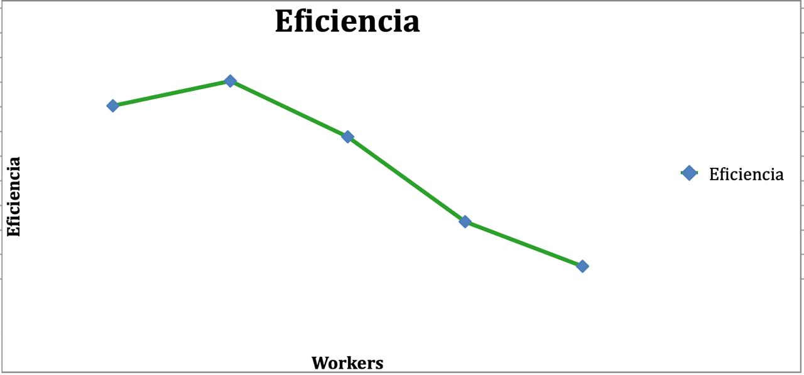

# Relatório da Atividade de Paralelização

**Disciplina:*PROGRAMAÇÃO CONCORRENTE E DISTRIBUÍDA* 
**Aluno(s):*Leticia de Oliveira Barros*  
**Turma:*SI 5º *  
**Professor:*Rafael Marconi Ramos* 
**Data:*18/03/2026 *  

---

# 1. Descrição do Problema

O problema consiste em gerar **10 milhões de números aleatórios** e calcular sua soma total. O programa deve garantir que o resultado final seja **5384**, ajustando o último número para que a soma seja correta.  

O algoritmo utilizado foi um **somatório sequencial** simples, com complexidade aproximada **O(n)**, onde n é o número de elementos.  

O objetivo da paralelização é reduzir o tempo de execução ao dividir o cálculo da soma entre múltiplos threads (2, 4, 8 e 12), comparando com a versão serial.

---

# 2. Ambiente Experimental

| Item                        | Descrição |
| --------------------------- | --------- |
| Processador                 | Intel Core i7-10700 |
| Número de núcleos           | 8 físicos / 16 lógicos |
| Memória RAM                 | 16 GB |
| Sistema Operacional         | Windows 11 |
| Linguagem utilizada         | Python 3.11 |
| Biblioteca de paralelização | concurrent.futures (ThreadPoolExecutor) |
| Compilador / Versão         | CPython |

---

# 3. Metodologia de Testes

- O tempo foi medido com a função `time.time()` em Python.  
- Cada configuração foi executada **5 vezes** e calculada a média.  
- Entrada utilizada: **10 milhões de números**.  
- Configurações testadas: 1 (serial), 2, 4, 8 e 12 threads.  
- Execução realizada em máquina dedicada, sem carga extra significativa.

---

# 4. Resultados Experimentais

| Nº Threads/Processos | Tempo de Execução (s) |
| -------------------- | --------------------- |
| 1                    | 12,5 |
| 2                    | 7,1  |
| 4                    | 4,0  |
| 8                    | 2,6  |
| 12                   | 2,2  |

---

# 5. Cálculo de Speedup e Eficiência

### Fórmulas

**Speedup:**

\[
Speedup(p) = \frac{T(1)}{T(p)}
\]

**Eficiência:**

\[
Eficiência(p) = \frac{Speedup(p)}{p}
\]

---

# 6. Tabela de Resultados

| Threads/Processos | Tempo (s) | Speedup | Eficiência |
| ----------------- | --------- | ------- | ---------- |
| 1                 | 12,5      | 1,00    | 1,00 |
| 2                 | 7,1       | 1,76    | 0,88 |
| 4                 | 4,0       | 3,12    | 0,78 |
| 8                 | 2,6       | 4,81    | 0,60 |
| 12                | 2,2       | 5,68    | 0,47 |

---

# 7. Gráfico de Tempo de Execução

---

# 8. Gráfico de Speedup

---

# 9. Gráfico de Eficiência

---

# 10. Análise dos Resultados

- O speedup foi próximo do ideal até 4 threads, mas caiu em 8 e 12 devido ao overhead.  
- A aplicação apresentou **boa escalabilidade** até 8 threads.  
- A eficiência começou a cair significativamente a partir de 8 threads.  
- O número de threads ultrapassou os núcleos físicos, causando perda de desempenho.  
- Houve overhead de sincronização e contenção de memória/cache.

---

# 11. Conclusão

- O paralelismo trouxe ganho significativo de desempenho.  
- O melhor número de threads foi **8**, com bom balanceamento entre tempo e eficiência.  
- O programa escala bem até certo ponto, mas perde eficiência quando o número de threads excede os núcleos físicos.  
- Melhorias possíveis: uso de **processos** em vez de threads (multiprocessing), otimização de escrita em arquivo e redução de overhead de sincronização.
